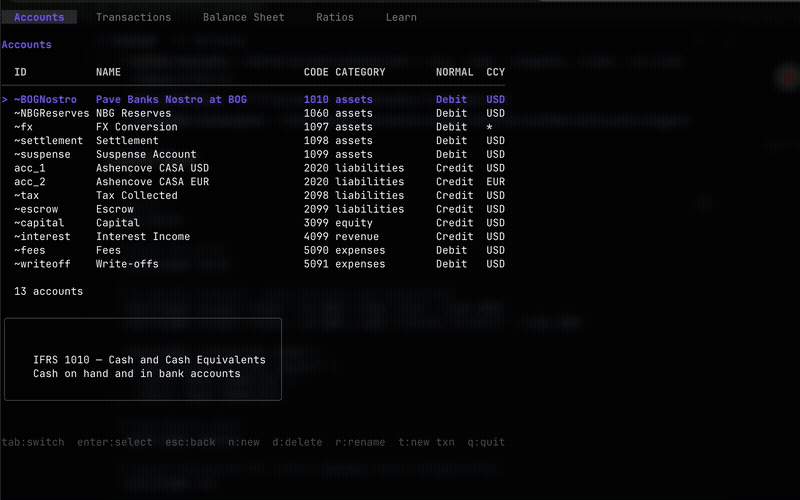

# miniledger

<p align="center">
  
</p>

A double-entry accounting ledger backed by SQLite, with CLI, TUI, and HTTP server modes. Follows IFRS chart of accounts and enforces balanced transactions at both application and database level.

## Features

- **Double-entry enforcement** — Every transaction must balance (per-currency sum of debits and credits = 0), enforced by SQLite triggers and application logic
- **IFRS Chart of Accounts** — Predefined account categories: Assets (1xxx), Liabilities (2xxx), Equity (3xxx), Revenue (4xxx), Expenses (5xxx)
- **Multi-currency** — Amounts stored as integers in minor units (cents), per-currency balance within transactions
- **System accounts** — Internal accounts prefixed with `~` (e.g., `~fees`, `~suspense`, `~float`, `~fx`) auto-created on first run
- **Four interfaces** — HTTP server, CLI, interactive TUI (Bubble Tea), and browser-based web terminal (Ghostty WASM)
- **Immutable transactions** — Once finalized, transaction entries cannot be modified (enforced by triggers)

## Quick Start

```bash
# Build
make build

# Start the server
./miniledger serve

# In another terminal, create accounts and transactions
./miniledger account create --id 1010 --name "Cash" --code 1010
./miniledger account create --id 2020 --name "Customer Accounts" --code 2020

./miniledger transaction create \
  --description "Customer deposit" \
  --entry "1010:+50000:USD" \
  --entry "2020:-50000:USD"

# View balance sheet
./miniledger balance

# Launch interactive TUI (starts embedded server automatically)
./miniledger tui

# Or run in the browser via Ghostty WASM terminal
./miniledger web
# Open http://localhost:8833
```

## Architecture

```
cmd/                  CLI commands (cobra)
internal/
  ledger/             Pure domain types (Account, Transaction, Entry, Currency)
  store/              SQLite persistence with migrations and triggers
  server/             HTTP API (chi router)
  client/             HTTP client for CLI/TUI to talk to server
  tui/                Bubble Tea terminal UI
  web/                Browser terminal (Ghostty WASM + WebSocket + PTY)
```

### Data Flow

```
CLI/TUI → HTTP Client → HTTP Server (chi) → Store (SQLite)
                                                  ↓
                                           SQLite Triggers
                                        (balance enforcement)
```

## CLI Usage

```
miniledger serve [--addr :8888] [--db ledger.db]     Start HTTP server
miniledger tui [--server http://localhost:8888]       Launch TUI
miniledger web [--port 8833] [--host localhost]       Launch TUI in browser
miniledger account create --id --name --code [--currency USD]
miniledger account list [--category assets]
miniledger account get <id>
miniledger account balance <id>
miniledger transaction create --description "..." --entry "acct:amt:ccy" [--entry ...]
miniledger transaction list [--account <id>]
miniledger transaction get <id>
miniledger balance                                   Balance sheet
miniledger balance trial                             Trial balance
```

### Entry Format

Entries use the compact format `account_id:amount:currency`:
- Amount is in minor units (cents for USD)
- Positive = debit, negative = credit
- Example: `1010:+50000:USD` debits Cash $500.00

## Web Mode

Run the full TUI in your browser using the [Ghostty WASM](https://github.com/coder/ghostty-web) terminal emulator:

```bash
./miniledger web                          # http://localhost:8833
./miniledger web --port 9000              # custom port
./miniledger web --host 0.0.0.0           # listen on all interfaces
```

Each browser tab gets its own independent TUI session via a PTY subprocess connected over WebSocket.

## TUI

The TUI has three main views (switch with `Tab`):

| View | Description |
|------|-------------|
| **Accounts** | List all accounts, press `Enter` to view details |
| **Transactions** | List all transactions, press `Enter` for details |
| **Balance Sheet** | Formatted balance sheet report |

### TUI Keys

| Key | Action |
|-----|--------|
| `Tab` / `Shift+Tab` | Switch between views |
| `Enter` | Select / drill into detail |
| `Esc` | Back to list |
| `n` | New account (wizard) |
| `j/k` or `Up/Down` | Navigate |
| `q` / `Ctrl+C` | Quit |

### Account Creation Wizard

Press `n` in the Accounts view to launch the wizard:
1. Select IFRS category (Assets, Liabilities, Equity, Revenue, Expenses)
2. Enter account code (validated against category range)
3. Enter account ID
4. Enter account name
5. Select currency
6. Confirm and create

## API Endpoints

All endpoints under `/api/v1`:

| Method | Path | Description |
|--------|------|-------------|
| `POST` | `/accounts` | Create account |
| `GET` | `/accounts` | List accounts |
| `GET` | `/accounts/{id}` | Get account |
| `GET` | `/accounts/{id}/balance` | Get balance |
| `GET` | `/accounts/{id}/entries` | List entries |
| `POST` | `/transactions` | Create transaction |
| `GET` | `/transactions` | List transactions |
| `GET` | `/transactions/{id}` | Get transaction |
| `GET` | `/reports/balance-sheet` | Balance sheet |
| `GET` | `/reports/trial-balance` | Trial balance |
| `GET` | `/chart` | IFRS chart reference |

### Example: Create Transaction

```bash
curl -X POST http://localhost:8888/api/v1/transactions \
  -H "Content-Type: application/json" \
  -d '{
    "description": "Customer deposit",
    "entries": [
      {"account_id": "1010", "amount": 50000, "currency": "USD"},
      {"account_id": "2020", "amount": -50000, "currency": "USD"}
    ]
  }'
```

## IFRS Chart of Accounts

| Code | Name | Category |
|------|------|----------|
| 1010 | Cash and Cash Equivalents | Assets |
| 1020 | Accounts Receivable | Assets |
| 1030 | Inventory | Assets |
| 1040 | Prepaid Expenses | Assets |
| 1050 | Property, Plant & Equipment | Assets |
| 2010 | Accounts Payable | Liabilities |
| **2020** | **Customer Accounts** | **Liabilities** |
| 2030 | Accrued Expenses | Liabilities |
| 2040 | Loans Payable | Liabilities |
| 3010 | Retained Earnings | Equity |
| 3020 | Common Stock | Equity |
| 4010 | Service Revenue | Revenue |
| 4020 | Interest Income | Revenue |
| 5010 | Operating Expenses | Expenses |
| 5020 | Cost of Goods Sold | Expenses |
| 5030 | Salaries and Wages | Expenses |
| 5040 | Depreciation | Expenses |

### System Accounts (auto-created)

| ID | Name | Purpose |
|----|------|---------|
| `~fees` | Fee Income | Fee income from customer charges |
| `~suspense` | Suspense Account | Temporary holding for unclassified entries |
| `~float` | Float Account | Cash in transit |
| `~fx` | FX Conversion | Cross-currency transaction intermediary |

## Multi-Currency

Each account has a designated currency. Entries must match the account's currency. For cross-currency transactions, use the `~fx` account (accepts all currencies):

```bash
# Convert 100 EUR to 110 USD
curl -X POST http://localhost:8888/api/v1/transactions \
  -d '{
    "description": "FX: EUR to USD",
    "entries": [
      {"account_id": "1010", "amount": 11000, "currency": "USD"},
      {"account_id": "~fx",  "amount": -11000, "currency": "USD"},
      {"account_id": "~fx",  "amount": 10000, "currency": "EUR"},
      {"account_id": "1011", "amount": -10000, "currency": "EUR"}
    ]
  }'
```

## Double-Entry Enforcement

Transactions use a two-phase commit:

1. Insert transaction row (`finalized=0`)
2. Insert all entry rows
3. Set `finalized=1` — SQLite trigger fires, verifying per-currency `SUM(amount) = 0`
4. If trigger rejects (unbalanced), entire SQL transaction rolls back

Additional triggers prevent:
- Adding/modifying/deleting entries on finalized transactions
- Entry currency mismatching account currency

## Development

```bash
make build       # Build binary
make test        # Run tests
make run-server  # Build and start server
make run-tui     # Build and start TUI
make run-web     # Build and start web terminal
make clean       # Remove binary and database
```
